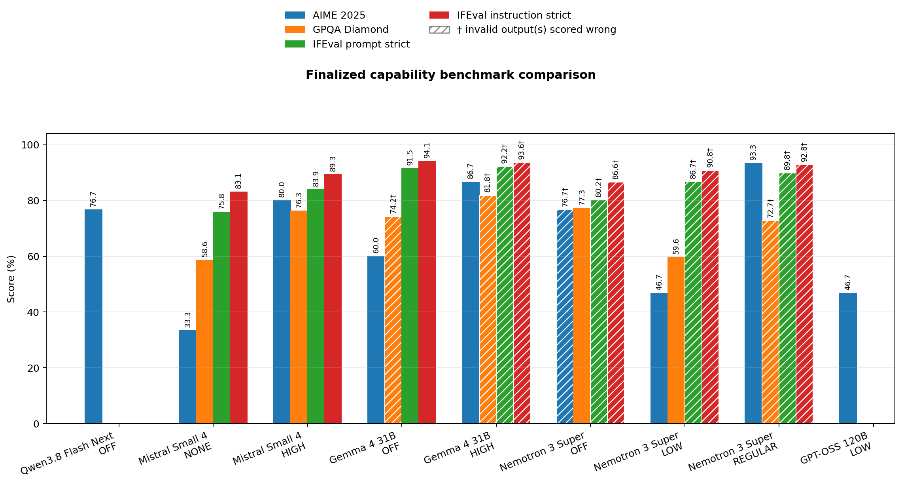

# GB10 LLM Docker recipes

Known-good, reproducible Docker launch recipes for open-weight LLMs on NVIDIA
GB10 systems such as DGX Spark and HP ZGX Nano.

Each recipe pins both the serving image and model checkpoint. Secrets are never
stored in the repository; gated models read `HF_TOKEN` from the environment.

## Benchmark tools

- [OpenAI-compatible capability and throughput suite](benchmark-tools/openai-compatible-suite/)
  runs AIME 2025, IFEval, and calibrated fixed-token performance workloads
  against an already-running vLLM server.
- [Uniform benchmark reporting tools](benchmark-tools/reporting/) build the
  standard speculative-decoding reports and the capability comparison chart.
- [SWE-bench Verified agent and official evaluator](benchmark-tools/swe-bench-verified/)
  provide a pinned, guarded 500-task coding-agent campaign for every explicit
  reasoning mode without queuing or starting a run during setup.

## Speculative-decoding results

All reports use the same CSV/JSON metric names and the same five plots. A
parameter sweep is kept distinct from an on/off comparison. Cross-model token
rates describe these particular single-GB10 deployments; algorithm uplift is
only shown where the same-model report includes a no-speculation baseline.

| Model | Type | Selected configuration | Mean output tok/s | vs baseline | Draft acceptance | Key qualification | Report |
| --- | --- | --- | ---: | ---: | ---: | --- | --- |
| Qwen3.8-Flash-Next | MTP depth sweep | MTP 2 | 49.26 | n/a | 56.2% | No MTP-off baseline; one repeat per cell | [Report](qwen3.8-flash-next/benchmarks/2026-09-12-mtp-sweep/) |
| Nemotron-3 Super 120B NVFP4 | Speculative comparison | External MTPv2, 3 tokens | 30.03 | +27.8% | 60.8% | One repeat; historical reasoning labels | [Report](nemotron-3-super-120b-nvfp4/benchmarks/2026-09-17-mtp-comparison/) |
| Mistral Small 4 119B NVFP4 | Speculative comparison | Baseline (no speculation) | 54.59 | +0.0% | n/a | Three repeats; EAGLE slower in every cell | [Report](mistral-small-4-119b-nvfp4/benchmarks/2026-09-17-eagle-comparison/) |

## Capability results

The [finalized score matrix](benchmark-results/capability/finalized-scores.md)
and [machine-readable CSV](benchmark-results/capability/scores.csv) contain
only completed explicit temperature-zero task runs. Hatched bars mark runs in
which capped/null single responses were retained and scored incorrect.
Reference-only, vendor-extra, partial, and active runs are excluded.

## Recipes

| Model | Runtime | API port | Notes |
| --- | --- | ---: | --- |
| [Qwen3.8-Flash-Next](qwen3.8-flash-next/) | Pinned vLLM nightly | 8000 | MTP2 with staged disk-backed PLE and bundled overlays |
| [Mistral Small 4 119B NVFP4](mistral-small-4-119b-nvfp4/) | vLLM 0.28.0 | 8021 | Validated without speculative decoding/EAGLE |
| [Nemotron-3 Super 120B NVFP4](nemotron-3-super-120b-nvfp4/) | vLLM 0.28.0 | 8031 | MTPv2 with 3 speculative tokens |
