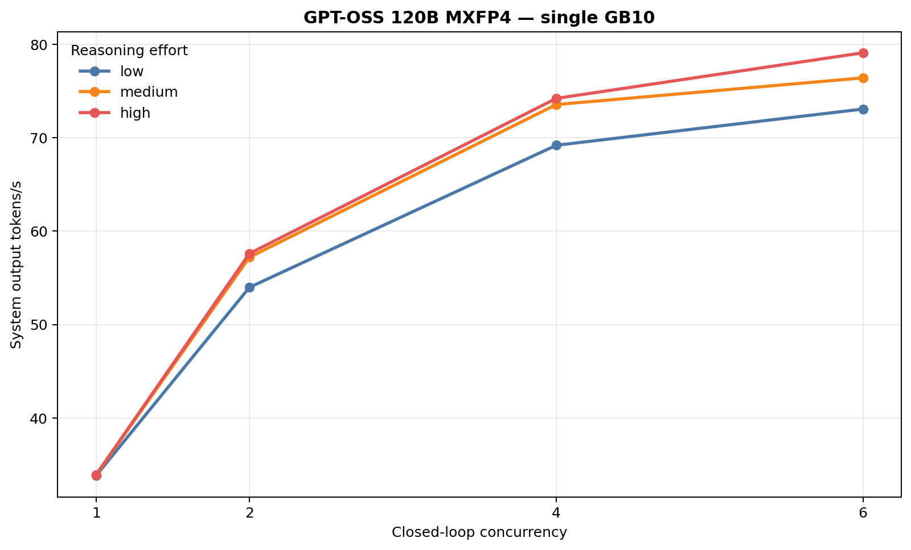
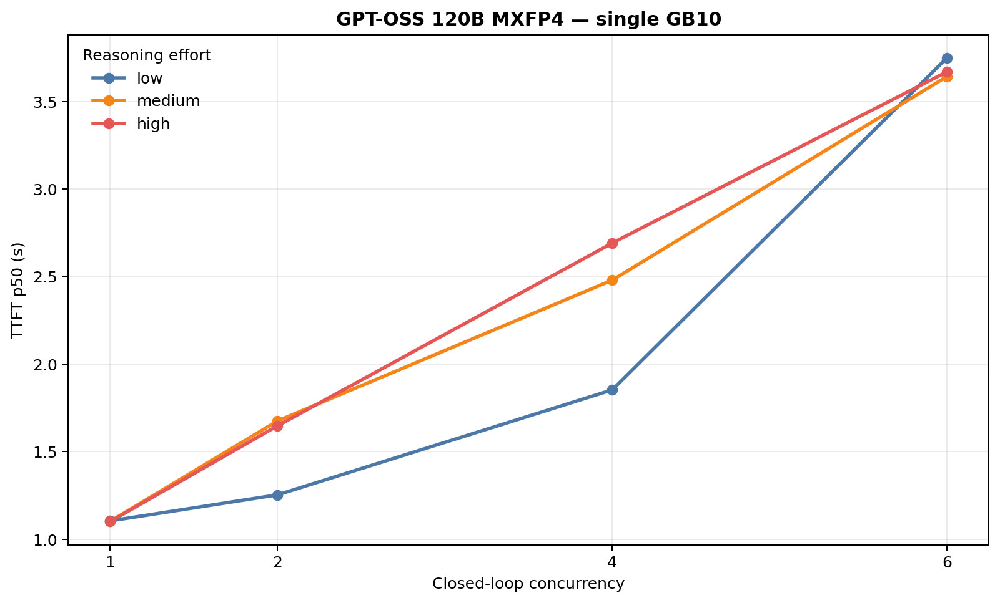
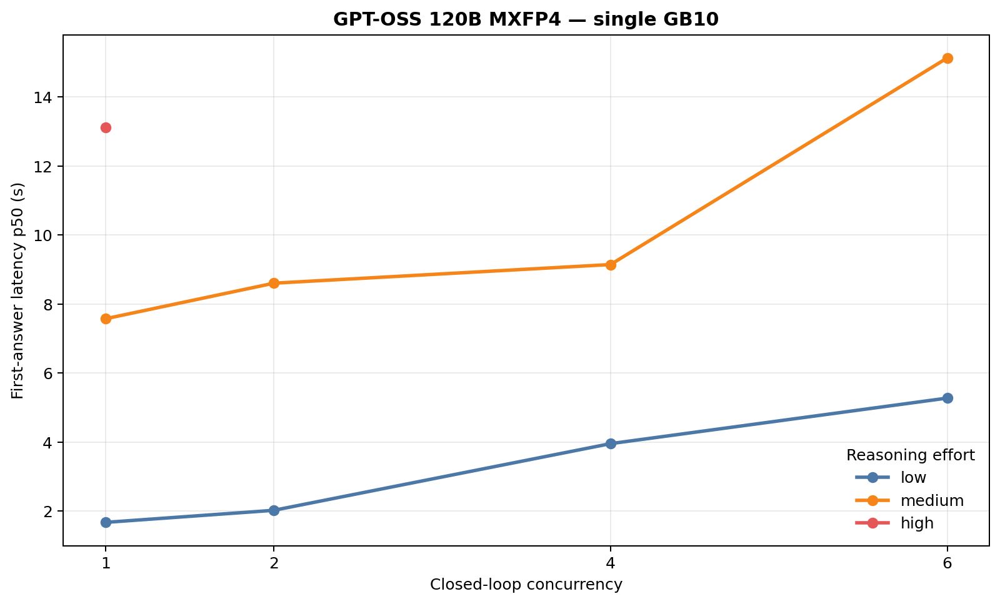
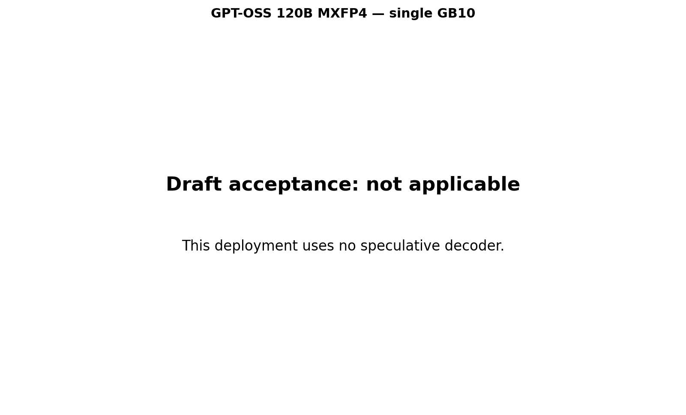
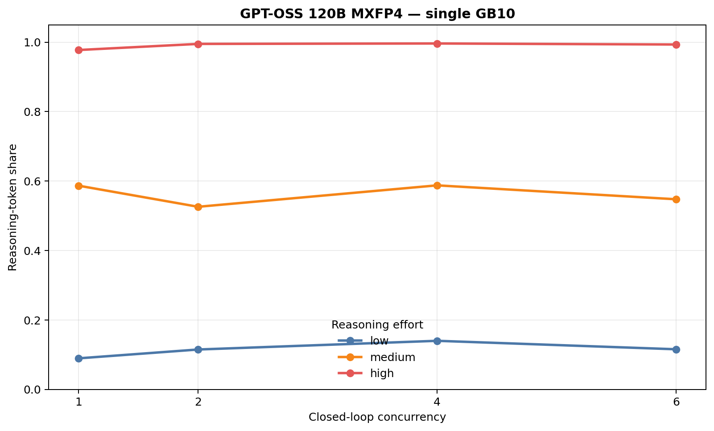

# GPT-OSS 120B MXFP4 throughput matrix

**Status:** PASS. **Scope:** one non-speculative vLLM deployment on one NVIDIA GB10. **Sample:** 12 cells and 120/120 successful measured requests, with one repeat per cell. **Selection:** low effort at concurrency 6 is the practical configuration at 73.07 system output tok/s with a 100% visible-answer rate. **Main limitation:** this is a one-repeat matrix, and medium/high frequently spent the 512-token cap in reasoning before producing visible answer text.

The raw throughput peak was 79.10 tok/s at high effort and concurrency 6, but high effort produced visible answer text in only 2.5% of measured requests across the matrix. Medium averaged 60.27 tok/s with a 75.0% visible-answer rate. Low averaged 57.51 tok/s and reached visible answer text in every request.

## Plots

## Cell results

| Effort | Concurrency | Output tok/s | TTFT p50 (s) | First answer p50 (s) | Visible answer | Reasoning share | Success |
| --- | ---: | ---: | ---: | ---: | ---: | ---: | ---: |
| low | 1 | 33.81 | 1.10 | 1.67 | 100% | 8.9% | 10/10 |
| low | 2 | 53.98 | 1.25 | 2.02 | 100% | 11.5% | 10/10 |
| low | 4 | 69.19 | 1.85 | 3.95 | 100% | 14.0% | 10/10 |
| low | 6 | 73.07 | 3.75 | 5.27 | 100% | 11.5% | 10/10 |
| medium | 1 | 33.92 | 1.10 | 7.57 | 70% | 58.7% | 10/10 |
| medium | 2 | 57.20 | 1.68 | 8.60 | 80% | 52.6% | 10/10 |
| medium | 4 | 73.55 | 2.48 | 9.15 | 70% | 58.8% | 10/10 |
| medium | 6 | 76.41 | 3.64 | 15.13 | 80% | 54.7% | 10/10 |
| high | 1 | 33.90 | 1.10 | 13.12 | 10% | 97.7% | 10/10 |
| high | 2 | 57.60 | 1.65 | — | 0% | 99.5% | 10/10 |
| high | 4 | 74.21 | 2.69 | — | 0% | 99.6% | 10/10 |
| high | 6 | 79.10 | 3.67 | — | 0% | 99.3% | 10/10 |

Machine-readable artifacts: [summary CSV](comparison_summary.csv), [cell CSV](comparison_by_repeat.csv), and [structured JSON](comparison_report.json).

## Workload and configuration

- OpenAI-compatible streaming `POST /v1/responses`.
- Ten fixed prompts per cell: nine deterministically selected NVIDIA SPEED-Bench `throughput_2k` prompts plus `tell me a 1000 word story`.
- Dataset selection SHA-256: `96765a32a67a83f07ddded74cfd5639a7c2afd1a1ff0f3c244b1cff0a9732f3b`.
- Reasoning efforts: `low`, `medium`, and `high`, sent explicitly on every request.
- Closed-loop concurrency: 1, 2, 4, and 6.
- Maximum output: 512 tokens; natural completion was allowed.
- Two excluded warmup batches before every concurrency level, using low effort and a 128-token output cap.
- Sampling: temperature 0.7, top-p 0.8, top-k 20, min-p 0.0, presence penalty 1.5.
- Target: `openai/gpt-oss-120b` revision `b5c939de8f754692c1647ca79fbf85e8c1e70f8a`, native MXFP4 MoE weights, TP=1, FP8 KV cache, 131,072-token context, no speculative decoding.
- Runtime declared by the pinned launcher: vLLM 0.28.0 Ubuntu 24.04 image digest `sha256:f8fe15a8039343336945db10494eaad80ef941fe2b2a5fa6649fa38636051a65`.

The test did not alter or restart the server. The endpoint advertised exactly one model with the expected 131,072-token context before measurement, and Prometheus reported zero running and queued requests before the valid run. Host SSH credentials were unavailable, so the image digest and launch arguments are launcher-declared rather than independently captured from `docker inspect`; no host-side GPU power samples are reported.

## Interpretation

Raw output-token throughput alone overstates useful throughput when reasoning consumes the output cap. Low effort is the practical choice for this 512-token workload because it retains all visible answers while reaching 73.07 tok/s at concurrency 6. High effort's 79.10 tok/s peak should not be read as superior answer throughput: only one of its 40 requests reached visible answer text.
