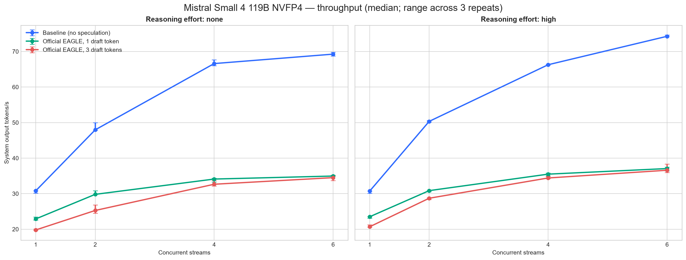
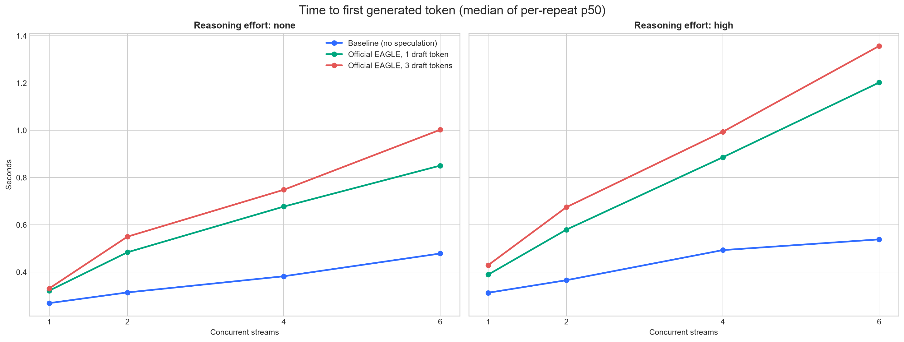
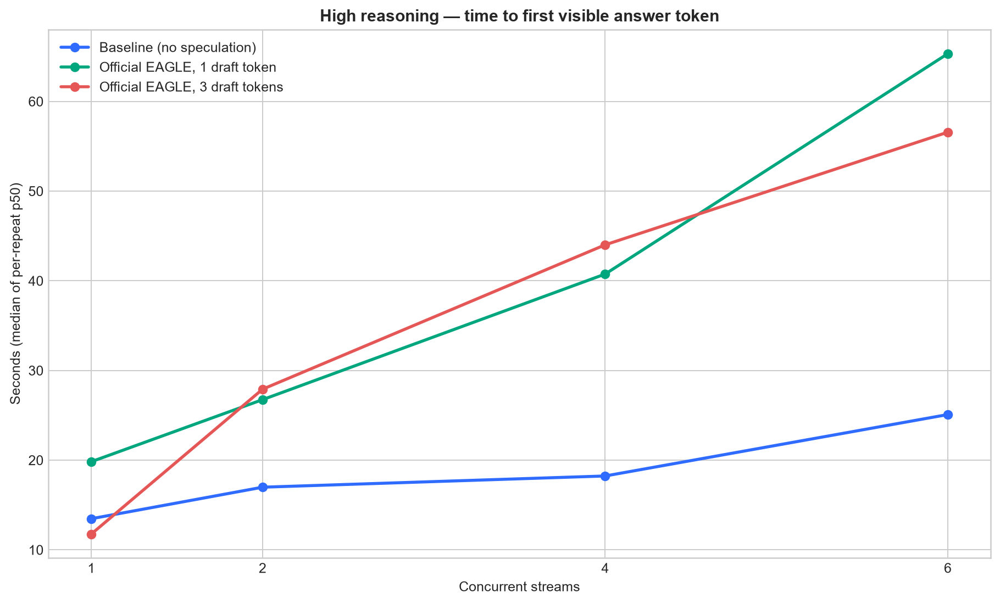
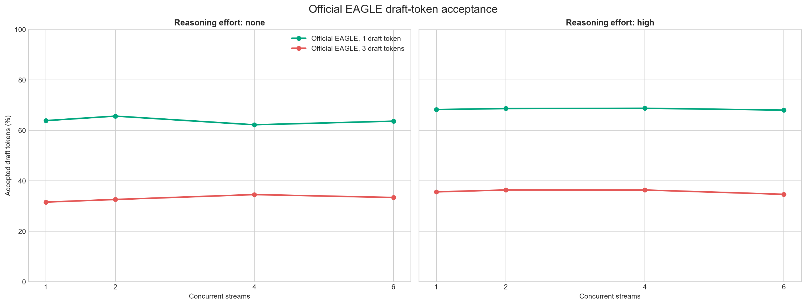
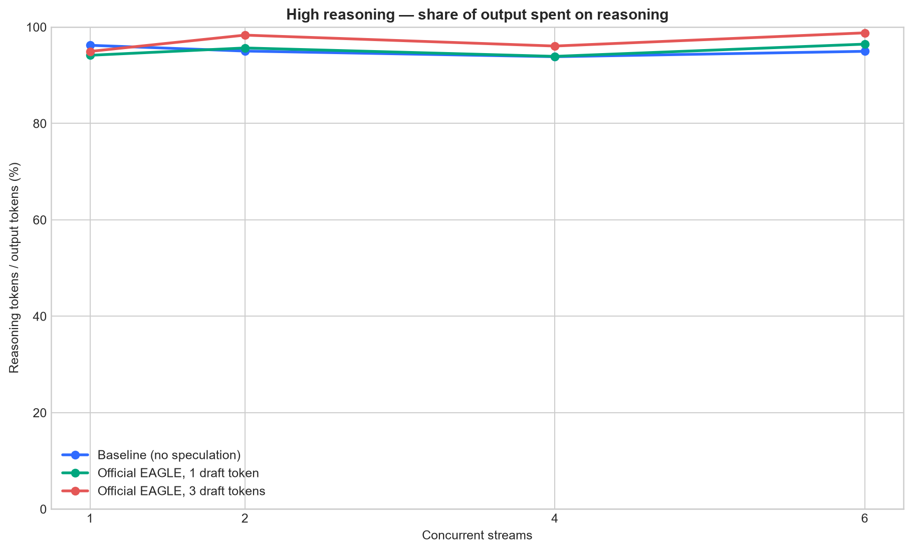

# Mistral Small 4 119B NVFP4 speculative-decoding benchmark

**Status: complete speculative comparison.** The report contains 72 measured
cells and 720 successful requests: baseline, EAGLE-1, and EAGLE-3 across two
reasoning modes, four concurrency levels, and three repeats. All values in the
detailed table are medians across the three ten-prompt repeats.

## Result

The non-speculative baseline won every tested effort/load cell. Across all 24
per-repeat rows per deployment, it averaged 54.59 system output tokens/s;
EAGLE-1 averaged 31.07 (-43.1%) and EAGLE-3 averaged 29.19 (-46.5%). The
official EAGLE head works, but its verification overhead did not pay back on
this single-GB10 NVFP4 deployment.

| Configuration | Measured requests | Mean output tok/s | vs baseline | Weighted acceptance | Mean accepted length |
| --- | ---: | ---: | ---: | ---: | ---: |
| Baseline (no speculation) | 240 | 54.59 | +0.0% | — | — |
| Official EAGLE, 1 draft token | 240 | 31.07 | -43.1% | 66.3% | 1.66 |
| Official EAGLE, 3 draft tokens | 240 | 29.19 | -46.5% | 34.5% | 2.03 |

Machine-readable results: [summary CSV](comparison_summary.csv),
[per-repeat CSV](comparison_by_repeat.csv), and
[structured JSON](comparison_report.json).

## Uniform plots

### Output throughput



### Time to first token



### Time to first visible answer



### Draft-token acceptance



### Reasoning-token share



## Detailed results

| Effort | Configuration | Concurrency | Output tok/s | vs baseline | TTFT p50 | First answer p50 | Visible answer rate | Reasoning share | Draft acceptance |
|---|---|---:|---:|---:|---:|---:|---:|---:|---:|
| none | Baseline (no speculation) | 1 | 30.79 | +0.0% | 0.269s | 0.269s | 100.0% | 0.0% | — |
| none | Baseline (no speculation) | 2 | 47.95 | +0.0% | 0.314s | 0.314s | 100.0% | 0.0% | — |
| none | Baseline (no speculation) | 4 | 66.60 | +0.0% | 0.383s | 0.383s | 100.0% | 0.0% | — |
| none | Baseline (no speculation) | 6 | 69.25 | +0.0% | 0.479s | 0.479s | 100.0% | 0.0% | — |
| none | Official EAGLE, 1 draft token | 1 | 22.89 | -25.7% | 0.322s | 0.322s | 100.0% | 0.0% | 63.9% |
| none | Official EAGLE, 1 draft token | 2 | 29.80 | -37.8% | 0.484s | 0.484s | 100.0% | 0.0% | 65.7% |
| none | Official EAGLE, 1 draft token | 4 | 34.11 | -48.8% | 0.677s | 0.677s | 100.0% | 0.0% | 62.2% |
| none | Official EAGLE, 1 draft token | 6 | 34.95 | -49.5% | 0.851s | 0.851s | 100.0% | 0.0% | 63.7% |
| none | Official EAGLE, 3 draft tokens | 1 | 19.78 | -35.8% | 0.331s | 0.331s | 100.0% | 0.0% | 31.6% |
| none | Official EAGLE, 3 draft tokens | 2 | 25.27 | -47.3% | 0.550s | 0.550s | 100.0% | 0.0% | 32.6% |
| none | Official EAGLE, 3 draft tokens | 4 | 32.65 | -51.0% | 0.749s | 0.749s | 100.0% | 0.0% | 34.6% |
| none | Official EAGLE, 3 draft tokens | 6 | 34.50 | -50.2% | 1.002s | 1.002s | 100.0% | 0.0% | 33.4% |
| high | Baseline (no speculation) | 1 | 30.72 | +0.0% | 0.313s | 13.470s | 20.0% | 96.2% | — |
| high | Baseline (no speculation) | 2 | 50.33 | +0.0% | 0.366s | 16.985s | 26.7% | 95.0% | — |
| high | Baseline (no speculation) | 4 | 66.27 | +0.0% | 0.493s | 18.236s | 20.0% | 93.8% | — |
| high | Baseline (no speculation) | 6 | 74.28 | +0.0% | 0.539s | 25.084s | 23.3% | 95.0% | — |
| high | Official EAGLE, 1 draft token | 1 | 23.50 | -23.5% | 0.390s | 19.829s | 30.0% | 94.1% | 68.3% |
| high | Official EAGLE, 1 draft token | 2 | 30.85 | -38.7% | 0.580s | 26.748s | 20.0% | 95.7% | 68.7% |
| high | Official EAGLE, 1 draft token | 4 | 35.49 | -46.5% | 0.886s | 40.752s | 26.7% | 93.9% | 68.8% |
| high | Official EAGLE, 1 draft token | 6 | 37.06 | -50.1% | 1.202s | 65.324s | 23.3% | 96.5% | 68.1% |
| high | Official EAGLE, 3 draft tokens | 1 | 20.68 | -32.7% | 0.430s | 11.762s | 3.3% | 94.9% | 35.7% |
| high | Official EAGLE, 3 draft tokens | 2 | 28.71 | -43.0% | 0.675s | 27.912s | 6.7% | 98.3% | 36.4% |
| high | Official EAGLE, 3 draft tokens | 4 | 34.41 | -48.1% | 0.994s | 44.012s | 20.0% | 96.1% | 36.4% |
| high | Official EAGLE, 3 draft tokens | 6 | 36.59 | -50.7% | 1.357s | 56.569s | 10.0% | 98.8% | 34.7% |

## Interpretation and limitations

The original non-speculative deployment is the clear winner at every tested load. At reasoning effort `none`, EAGLE-1 loses 25.7% to 49.5% throughput and the documented EAGLE-3 setting loses 35.8% to 51.0%. At `high`, EAGLE-1 loses 23.5% to 50.1% and EAGLE-3 loses 32.7% to 50.7%. The official EAGLE head is functional, but its draft/verification overhead does not pay back on this single-GB10 NVFP4 deployment.

`high` reasoning spends roughly 90–100% of the 512-token cap on reasoning for many prompts. Time to first generated reasoning token remains low, but time to first visible answer can reach tens of seconds and some capped responses never reach answer text. The report therefore keeps TTFT, first-answer latency, visible-answer rate, and reasoning share separate.

EAGLE-3 also developed Responses-API stream timeouts after sustained concurrent use. The final invalid cell was quarantined and repeated successfully after a clean server restart; quarantined attempts remain in the result tree for auditability. The subsequent full `high` matrix completed without a failed measured request.

This historical throughput report records explicit `none` and `high` labels,
but predates the current per-request outbound-payload capture contract. It is
therefore not a source for the capability-score chart. The EAGLE compatibility
image was also a local derived image rather than a registry-pinned artifact.
These limitations do not change the measured within-matrix throughput result.

## Workload and reasoning modes

Ten fixed prompts per repeat: nine deterministically selected NVIDIA SPEED-Bench throughput_2k prompts plus the exact user story prompt. Maximum output was 512 tokens, reasoning effort was explicitly `none` or `high`, and each concurrency used two excluded warmup batches. Mistral Small 4's chat template supports these two reasoning modes; it does not define intermediate `low` or `medium` modes.

## Deployment variants

Mistral publishes an official EAGLE head for this exact target model, `mistralai/Mistral-Small-4-119B-2603-eagle`, and documents three speculative tokens. No native MTP checkpoint is published for Mistral Small 4. The vLLM speculators catalog also lists third-party DFlash and DSpark heads, but those are separate 2B BF16 speculators and were not mixed into this official-head comparison.

The tested vLLM fragment was:

```text
--speculative-config '{"model":"mistralai/Mistral-Small-4-119B-2603-eagle","num_speculative_tokens":3,"method":"eagle","max_model_len":65536}'
```

Everything else matched the original deployment: vLLM 0.28.0, target `mistralai/Mistral-Small-4-119B-2603-NVFP4`, TRITON_MLA, FP8 E4M3 KV cache, 0.85 GPU-memory utilization, 131072 target context, 4096 max batched tokens, eight max sequences, chunked prefill, and prefix caching.

## vLLM compatibility fix

vLLM 0.28.0's `EagleMistralLarge3ForCausalLM` wrapper did not expose two text-only multimodal helpers required by its inherited embedding path. The derived image `local/vllm-ms4-eagle-fix:v0.28.0-20260917-r2` adds only:

```python
_embed_text_input_ids = SupportsMultiModal._embed_text_input_ids
_has_oov_mm_tokens = False
```

## Preservation and final state

Before any change, the working container was committed as `local/mistral-small4-working-backup:20260917-133648`, with its inspect data, image metadata, logs, diff, and README saved under `$HOME/vllm-backups/vllm-mistral-small-4-119b-nvfp4-20260917-133648`. The original container itself was never removed.

After benchmarking, the temporary EAGLE container was removed and the original `vllm-mistral-small-4-119b-nvfp4` container was restarted. A real `/v1/responses` request returned `READY`; the non-speculative service is live on port 8021.
