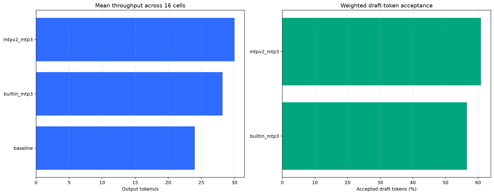
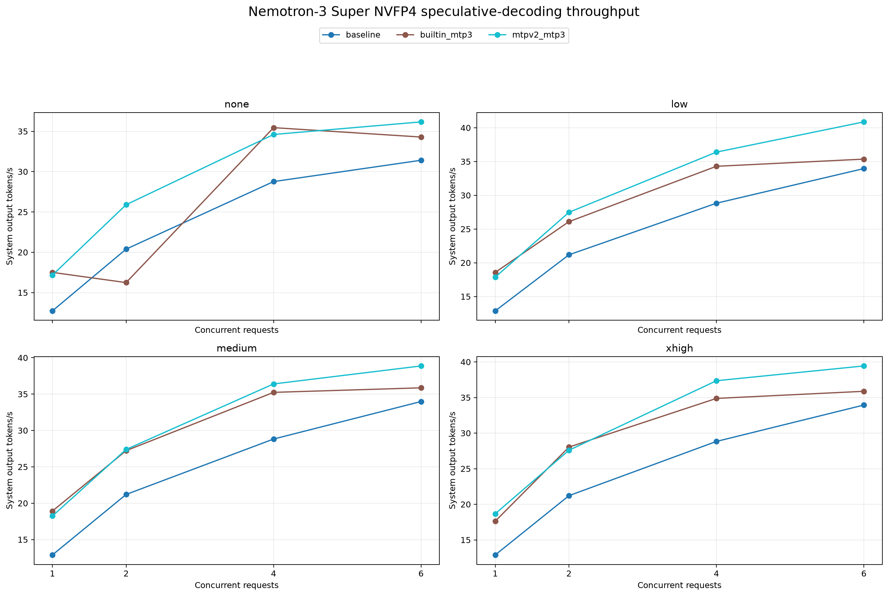

# Nemotron-3 Super 120B NVFP4 with MTPv2

Known-good single-GB10 vLLM configuration for
[`nvidia/NVIDIA-Nemotron-3-Super-120B-A12B-NVFP4`](https://huggingface.co/nvidia/NVIDIA-Nemotron-3-Super-120B-A12B-NVFP4)
using NVIDIA's separately trained
[`nvidia/Nemotron-3-Super-120B-A12B-BF16-MTPv2`](https://huggingface.co/nvidia/Nemotron-3-Super-120B-A12B-BF16-MTPv2)
speculative head.

## Pinned artifacts

- vLLM: `vllm/vllm-openai:v0.28.0-ubuntu2404`
- Immutable image: `vllm/vllm-openai@sha256:f8fe15a8039343336945db10494eaad80ef941fe2b2a5fa6649fa38636051a65`
- Target model revision: `ff433f5493e25d631c9f12b5d55c674229923d02`
- MTPv2 model revision: `c929f8a55d0527fea9f58b4cedc9e0c855cfc421`

## Launch

Export a Hugging Face token without placing it in this repository, then run the
launcher as a user with Docker access:

```bash
export HF_TOKEN='hf_...'
export HF_CACHE="$HOME/hf_cache"  # optional; this is the default
./launch.sh
```

If the host requires `sudo`, retain the token and recipe settings explicitly:

```bash
sudo --preserve-env=HF_TOKEN,HUGGING_FACE_HUB_TOKEN,HF_CACHE,PORT,CONTAINER_NAME \
  ./launch.sh
```

The OpenAI-compatible API listens on host port `8031`. Override the host port,
cache path, or container name when needed:

```bash
PORT=9000 HF_CACHE=/data/hf_cache CONTAINER_NAME=nemotron-mtpv2 ./launch.sh
```

Test the Responses API:

```bash
curl http://localhost:8031/v1/responses \
  -H 'Content-Type: application/json' \
  -d '{
    "model": "nemotron-3-super-120b-nvfp4",
    "input": "Reply with exactly READY.",
    "max_output_tokens": 32,
    "reasoning": {"effort": "none"}
  }'
```

## Why this configuration

A 160-request OpenAI Responses API matrix on one NVIDIA GB10 averaged 30.03
output tokens per second with three MTPv2 draft tokens. The otherwise identical
no-speculation baseline averaged 23.99 output tokens per second, and the best
embedded-head configuration averaged 28.22 output tokens per second. Weighted
draft acceptance was 60.8%, with a mean accepted length of 2.83 tokens.

The external MTPv2 head needs `--gpu-memory-utilization 0.82` to retain the
131,072-token maximum context. At 0.80, vLLM exposed only 1.24 GiB for KV cache,
short of the 1.48 GiB required. EAGLE was not selected because Nemotron-3 Super
has native MTP support and NVIDIA provides this architecture-matched MTPv2 head.

## Benchmark report

The published results contain 16 measured cells and 160 successful requests per
configuration. The matrix covers reasoning efforts `none`, `low`, `medium`, and
`xhigh` at concurrency levels 1, 2, 4, and 6. Each concurrency level was warmed
up before measurement.

- [Configuration summary](benchmark-results/configuration_summary.csv)
- [Full throughput matrix](benchmark-results/combined_matrix.csv)





## Validated configuration

- One NVIDIA GB10 GPU with 128 GB unified memory
- Three speculative tokens from the external MTPv2 head
- FlashInfer attention and Triton MoE for the draft model
- FP8 KV cache and float32 Mamba SSM cache
- 131,072-token maximum model length
- Prefix caching enabled
- Up to 8 concurrent sequences
- Nemotron v3 reasoning parser and Qwen3 XML tool-call parser
- OpenAI-compatible Responses API

The first cold start downloads and loads both the target checkpoint and MTPv2
head and can take several minutes. Docker reporting the container as running
does not mean the API is ready; wait for `GET /v1/models` to succeed.
