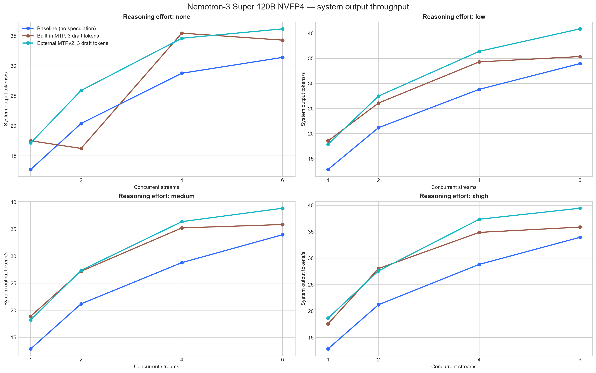
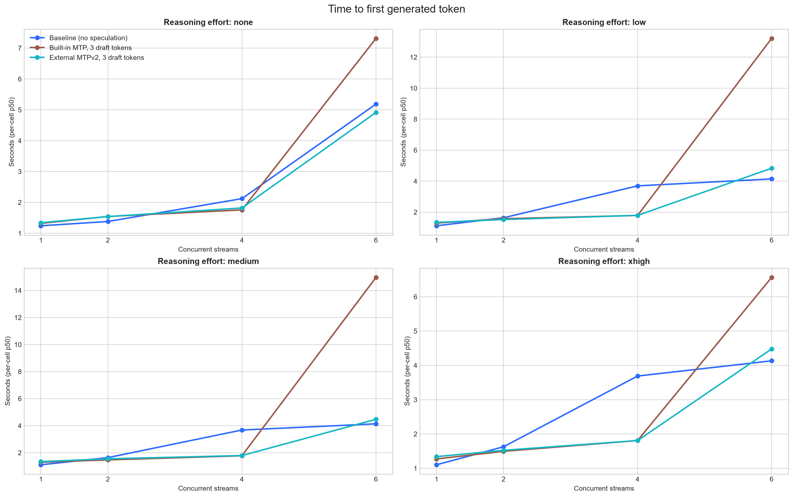
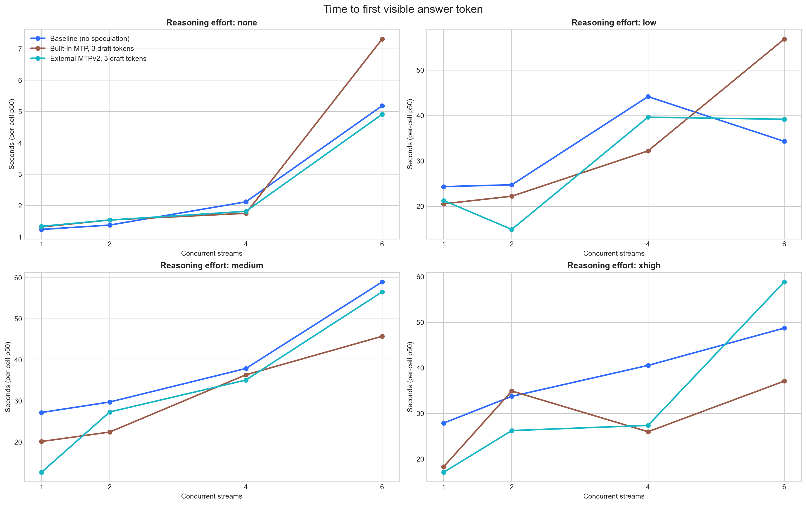
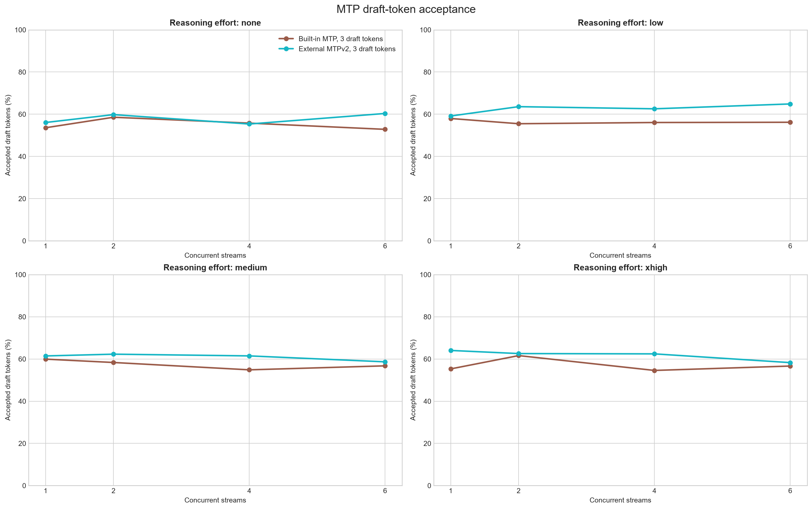
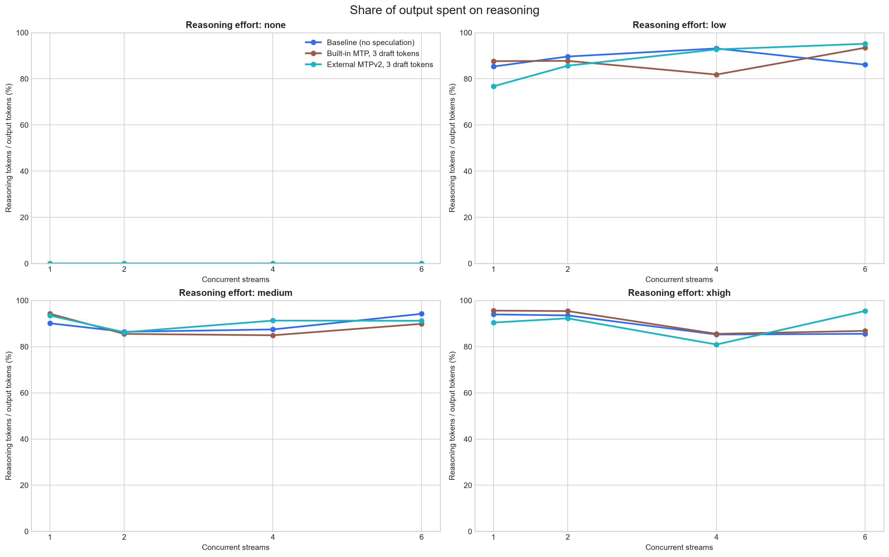

# Nemotron-3 Super 120B NVFP4 speculative-decoding benchmark

Each configuration contains 16 measured ten-prompt cells and 160 successful measured requests. The full comparison contains 480 successful measured requests. Values below are from one complete matrix run per deployment.

## Summary plots

### Output throughput



### Time to first token



### Time to first visible answer



### Draft-token acceptance



### Reasoning-token share



Machine-readable results: [summary CSV](comparison_summary.csv), [per-run CSV](comparison_by_repeat.csv), and [structured JSON](comparison_report.json).

## Detailed results

| Effort | Configuration | Concurrency | Output tok/s | vs baseline | TTFT p50 | First answer p50 | Visible answer rate | Reasoning share | Draft acceptance |
|---|---|---:|---:|---:|---:|---:|---:|---:|---:|
| none | Baseline (no speculation) | 1 | 12.73 | +0.0% | 1.243s | 1.243s | 100.0% | 0.0% | — |
| none | Baseline (no speculation) | 2 | 20.39 | +0.0% | 1.382s | 1.382s | 100.0% | 0.0% | — |
| none | Baseline (no speculation) | 4 | 28.76 | +0.0% | 2.122s | 2.122s | 100.0% | 0.0% | — |
| none | Baseline (no speculation) | 6 | 31.41 | +0.0% | 5.188s | 5.188s | 100.0% | 0.0% | — |
| none | Built-in MTP, 3 draft tokens | 1 | 17.51 | +37.5% | 1.322s | 1.322s | 100.0% | 0.0% | 53.6% |
| none | Built-in MTP, 3 draft tokens | 2 | 16.24 | -20.4% | 1.545s | 1.545s | 100.0% | 0.0% | 58.6% |
| none | Built-in MTP, 3 draft tokens | 4 | 35.45 | +23.2% | 1.757s | 1.757s | 100.0% | 0.0% | 55.8% |
| none | Built-in MTP, 3 draft tokens | 6 | 34.29 | +9.2% | 7.314s | 7.314s | 100.0% | 0.0% | 52.8% |
| none | External MTPv2, 3 draft tokens | 1 | 17.16 | +34.8% | 1.342s | 1.342s | 100.0% | 0.0% | 56.1% |
| none | External MTPv2, 3 draft tokens | 2 | 25.90 | +27.0% | 1.542s | 1.542s | 100.0% | 0.0% | 59.8% |
| none | External MTPv2, 3 draft tokens | 4 | 34.60 | +20.3% | 1.820s | 1.820s | 100.0% | 0.0% | 55.3% |
| none | External MTPv2, 3 draft tokens | 6 | 36.17 | +15.1% | 4.916s | 4.916s | 100.0% | 0.0% | 60.4% |
| low | Baseline (no speculation) | 1 | 12.87 | +0.0% | 1.119s | 24.351s | 40.0% | 85.3% | — |
| low | Baseline (no speculation) | 2 | 21.18 | +0.0% | 1.635s | 24.753s | 20.0% | 89.6% | — |
| low | Baseline (no speculation) | 4 | 28.82 | +0.0% | 3.695s | 44.184s | 20.0% | 93.1% | — |
| low | Baseline (no speculation) | 6 | 33.96 | +0.0% | 4.142s | 34.327s | 30.0% | 86.1% | — |
| low | Built-in MTP, 3 draft tokens | 1 | 18.57 | +44.3% | 1.294s | 20.559s | 40.0% | 87.6% | 58.0% |
| low | Built-in MTP, 3 draft tokens | 2 | 26.09 | +23.2% | 1.577s | 22.238s | 30.0% | 87.8% | 55.5% |
| low | Built-in MTP, 3 draft tokens | 4 | 34.29 | +19.0% | 1.785s | 32.224s | 40.0% | 81.8% | 56.1% |
| low | Built-in MTP, 3 draft tokens | 6 | 35.36 | +4.1% | 13.209s | 56.856s | 30.0% | 93.5% | 56.2% |
| low | External MTPv2, 3 draft tokens | 1 | 17.87 | +38.9% | 1.338s | 21.276s | 60.0% | 76.8% | 59.2% |
| low | External MTPv2, 3 draft tokens | 2 | 27.48 | +29.7% | 1.522s | 14.921s | 20.0% | 85.7% | 63.6% |
| low | External MTPv2, 3 draft tokens | 4 | 36.40 | +26.3% | 1.791s | 39.650s | 30.0% | 92.7% | 62.6% |
| low | External MTPv2, 3 draft tokens | 6 | 40.87 | +20.4% | 4.832s | 39.189s | 10.0% | 95.2% | 64.9% |
| medium | Baseline (no speculation) | 1 | 12.88 | +0.0% | 1.107s | 27.202s | 30.0% | 90.1% | — |
| medium | Baseline (no speculation) | 2 | 21.20 | +0.0% | 1.637s | 29.749s | 40.0% | 86.4% | — |
| medium | Baseline (no speculation) | 4 | 28.82 | +0.0% | 3.678s | 37.916s | 30.0% | 87.5% | — |
| medium | Baseline (no speculation) | 6 | 33.98 | +0.0% | 4.136s | 58.981s | 30.0% | 94.2% | — |
| medium | Built-in MTP, 3 draft tokens | 1 | 18.92 | +46.8% | 1.294s | 20.146s | 20.0% | 94.3% | 59.9% |
| medium | Built-in MTP, 3 draft tokens | 2 | 27.22 | +28.4% | 1.470s | 22.438s | 30.0% | 85.5% | 58.3% |
| medium | Built-in MTP, 3 draft tokens | 4 | 35.24 | +22.3% | 1.773s | 36.373s | 40.0% | 84.9% | 54.9% |
| medium | Built-in MTP, 3 draft tokens | 6 | 35.86 | +5.5% | 14.960s | 45.750s | 20.0% | 89.9% | 56.8% |
| medium | External MTPv2, 3 draft tokens | 1 | 18.24 | +41.5% | 1.341s | 12.651s | 10.0% | 93.5% | 61.4% |
| medium | External MTPv2, 3 draft tokens | 2 | 27.39 | +29.2% | 1.548s | 27.327s | 40.0% | 86.2% | 62.3% |
| medium | External MTPv2, 3 draft tokens | 4 | 36.40 | +26.3% | 1.790s | 35.101s | 20.0% | 91.3% | 61.5% |
| medium | External MTPv2, 3 draft tokens | 6 | 38.87 | +14.4% | 4.471s | 56.555s | 30.0% | 91.2% | 58.7% |
| xhigh | Baseline (no speculation) | 1 | 12.89 | +0.0% | 1.102s | 27.907s | 20.0% | 94.0% | — |
| xhigh | Baseline (no speculation) | 2 | 21.21 | +0.0% | 1.627s | 33.762s | 20.0% | 93.5% | — |
| xhigh | Baseline (no speculation) | 4 | 28.83 | +0.0% | 3.688s | 40.554s | 40.0% | 85.3% | — |
| xhigh | Baseline (no speculation) | 6 | 33.94 | +0.0% | 4.131s | 48.750s | 40.0% | 85.6% | — |
| xhigh | Built-in MTP, 3 draft tokens | 1 | 17.62 | +36.8% | 1.273s | 18.315s | 10.0% | 95.6% | 55.3% |
| xhigh | Built-in MTP, 3 draft tokens | 2 | 28.04 | +32.2% | 1.493s | 34.938s | 20.0% | 95.4% | 61.6% |
| xhigh | Built-in MTP, 3 draft tokens | 4 | 34.88 | +21.0% | 1.808s | 25.998s | 30.0% | 85.5% | 54.6% |
| xhigh | Built-in MTP, 3 draft tokens | 6 | 35.87 | +5.7% | 6.561s | 37.112s | 30.0% | 86.8% | 56.7% |
| xhigh | External MTPv2, 3 draft tokens | 1 | 18.68 | +44.9% | 1.339s | 17.099s | 30.0% | 90.4% | 64.0% |
| xhigh | External MTPv2, 3 draft tokens | 2 | 27.59 | +30.1% | 1.524s | 26.257s | 20.0% | 92.3% | 62.6% |
| xhigh | External MTPv2, 3 draft tokens | 4 | 37.36 | +29.6% | 1.808s | 27.385s | 40.0% | 80.9% | 62.4% |
| xhigh | External MTPv2, 3 draft tokens | 6 | 39.44 | +16.2% | 4.477s | 58.880s | 30.0% | 95.5% | 58.3% |

## Result

External MTPv2 with three draft tokens is the overall winner. Across all 16 cells, it averages 30.03 output tokens/s versus 28.22 for built-in MTP3 and 23.99 without speculation: 27.8% above baseline and 6.4% above the embedded head. MTPv2 averages 60.8% weighted draft-token acceptance and a 2.83-token mean accepted length, versus 56.6% and 2.70 for built-in MTP3.

MTPv2 is 0.9% slower than built-in MTP3 at concurrency 1, then leads by 11.0% at concurrency 2, 3.5% at concurrency 4, and 9.9% at concurrency 6. The external head therefore pays off most clearly once the server has concurrent work.

## Workload

Ten fixed prompts per cell: nine deterministically selected NVIDIA SPEED-Bench `throughput_2k` prompts plus the user story prompt. Maximum output was 512 tokens, reasoning effort was explicitly `none`, `low`, `medium`, or `xhigh`, and each concurrency used two excluded warmup batches. Concurrency levels were 1, 2, 4, and 6.

## Method selection

Nemotron-3 Super has native MTP support, and NVIDIA publishes the architecture-matched `nvidia/Nemotron-3-Super-120B-A12B-BF16-MTPv2` head. EAGLE was therefore not mixed into this comparison. The two speculative configurations were:

```text
--speculative-config '{"method":"mtp","num_speculative_tokens":3}'
--speculative-config '{"method":"mtp","model":"nvidia/Nemotron-3-Super-120B-A12B-BF16-MTPv2","num_speculative_tokens":3,"moe_backend":"triton"}'
```

Everything else matched: vLLM 0.28.0, target `nvidia/NVIDIA-Nemotron-3-Super-120B-A12B-NVFP4`, one GB10 GPU, FlashInfer attention, FP8 KV cache, float32 Mamba SSM cache, 131072 maximum context, 16384 maximum batched tokens, eight maximum sequences, prefix caching, and the Responses API. The external head used 0.82 GPU-memory utilization; 0.80 did not leave enough KV cache to retain the full context.

## Preservation and final state

Before testing, the working container was preserved as both an access-restricted metadata/log bundle and committed image. The original named container was stopped but never removed. The pinned MTPv2 recipe is now live on port 8031; `/v1/models` and a real `/v1/responses` request both succeeded, and vLLM metrics confirmed accepted draft tokens.
