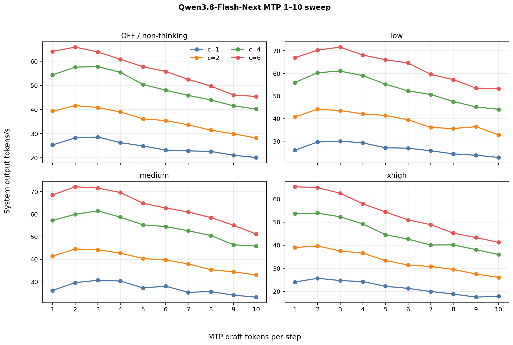
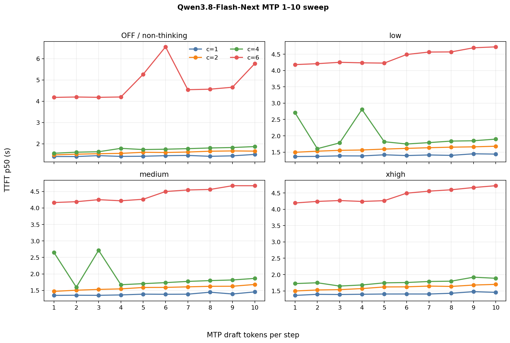
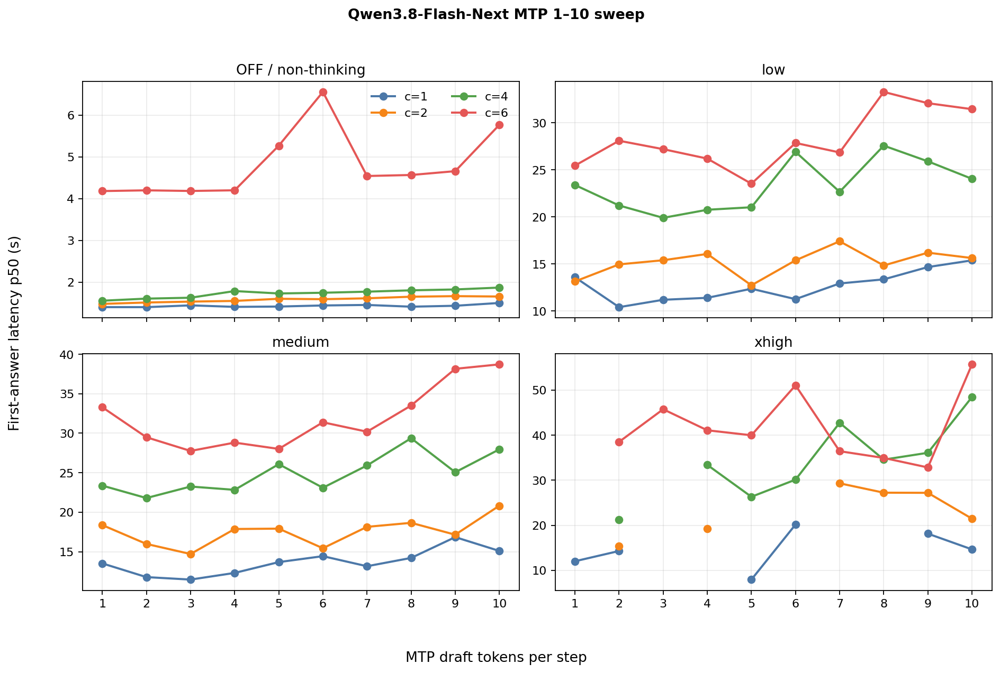
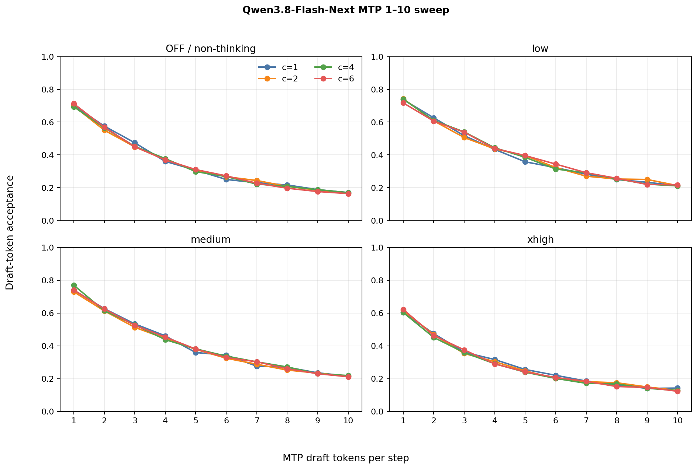
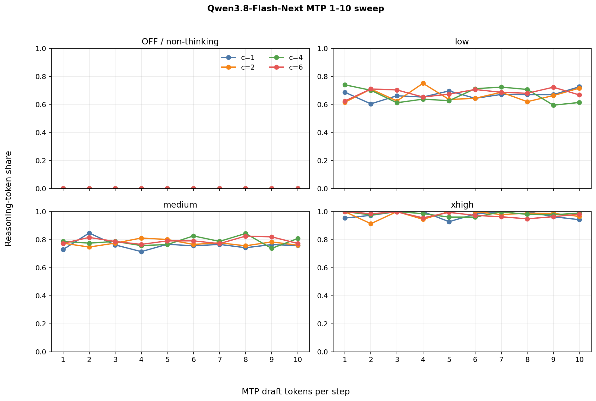

# Qwen3.8-Flash-Next MTP 1–10 parameter sweep

This complete sweep contains 160 measured cells and 1,600 successful requests:
ten MTP draft-token depths, four explicit historical effort labels, four
concurrency levels, and one repeat per cell. Every cell has ten successes and
zero errors.

## Result

MTP 2 is the balanced selection for this deployment. Across the 16 workload
scenarios it averaged 49.26 system output tokens/s and 1.083 completion tokens
per joule, with 56.2% weighted draft-token acceptance. MTP 3 was close on
throughput (48.90 tokens/s) but less efficient (1.054 tokens/J) and had lower
acceptance (46.1%). The declared selection score is computed independently in
each effort/concurrency scenario and then averaged:

```text
0.50 × throughput ratio + 0.30 × tokens/J ratio + 0.20 × inverse p90 TTFT ratio
```

This is a **parameter sweep, not an uplift comparison**. No MTP-off baseline
was measured, so these results cannot quantify speculative decoding versus
ordinary decoding.

| Rank | Variant | Mean output tok/s | Mean tokens/J | Weighted acceptance | Balanced score |
| ---: | --- | ---: | ---: | ---: | ---: |
| 1 | MTP 2 | 49.26 | 1.083 | 56.2% | 0.9876 |
| 2 | MTP 3 | 48.90 | 1.054 | 46.1% | 0.9773 |
| 3 | MTP 1 | 46.76 | 1.056 | 69.6% | 0.9567 |
| 4 | MTP 4 | 46.83 | 1.002 | 38.4% | 0.9451 |
| 5 | MTP 5 | 43.83 | 0.925 | 32.1% | 0.8882 |
| 6 | MTP 6 | 42.32 | 0.902 | 27.7% | 0.8660 |
| 7 | MTP 7 | 40.24 | 0.865 | 24.1% | 0.8271 |
| 8 | MTP 8 | 38.53 | 0.832 | 21.7% | 0.8062 |
| 9 | MTP 9 | 36.50 | 0.782 | 19.3% | 0.7734 |
| 10 | MTP 10 | 35.10 | 0.737 | 17.7% | 0.7404 |

Machine-readable results: [summary CSV](comparison_summary.csv),
[per-cell CSV](comparison_by_repeat.csv), and
[structured JSON](comparison_report.json).

## Uniform plots

### Output throughput



### Time to first token



### Time to first visible answer



Gaps mean no request in that measured cell reached visible answer text before
the output cap; they are not zero-second measurements.

### Draft-token acceptance



### Reasoning-token share



## Workload and deployment

- Model/API ID: `qwen3.8-flash-next`
- Hardware: one NVIDIA GB10 system
- vLLM: `0.28.1rc1.dev388+g8a728663c`
- Image: `vllm/vllm-openai:nightly-8a728663c1c3eeace834a95f5654fa653cc1998c`
- Quantization: ModelOpt NVFP4; FP8 KV cache
- Context limit: 262,144 tokens
- Prefix caching: disabled
- Prompts: nine deterministic NVIDIA SPEED-Bench `throughput_2k` prompts plus
  the exact story prompt
- Concurrency: 1, 2, 4, and 6, closed loop
- Output cap: 512 tokens
- Sampling: temperature 0.7, top-p 0.8, top-k 20, min-p 0,
  presence penalty 1.5
- Warmup: two excluded batches before each MTP/concurrency shape
- MTP variants: `{"method":"mtp","num_speculative_tokens":1}` through 10

The published files contain only aggregate measurements and source hashes; raw
prompt and response text remains outside the repository.

## Reasoning and answer qualification

The historical matrix labels are `none`, `low`, `medium`, and `xhigh`.
`none` is displayed as OFF/non-thinking in the plots. This older run did not
retain a complete exact outbound-payload audit for reasoning controls, so it
must not be merged with the newer explicit-mode capability matrix without that
qualification.

The historical environment capture retained the image build tag and vLLM
git-based version, but not the registry digest or model checkpoint revision.
The deployment also used Qwen/NVIDIA PLE, QSA, and ModelOpt compatibility
overlays whose private host paths are intentionally not published. Treat this
as an audited result publication, not a fully pinned launch recipe.

After selecting MTP 2, the story prompt was checked at a 2,048-token cap with
three repeats per mode. OFF, low, and medium produced visible answers in 3/3
repeats. `xhigh` produced no visible answer in 0/3: all three responses spent
the entire 2,048-token budget in reasoning and ended at `finish_reason=length`.
This qualification is separate from the 512-token throughput matrix.

## Reproduction

The sanitized publication was generated from the retained cell JSON with:

```bash
python benchmark-tools/reporting/build_qwen_mtp_report.py \
  /path/to/mtp1_10_speedbench_20260912 \
  qwen3.8-flash-next/benchmarks/2026-09-12-mtp-sweep
```

The builder verifies the full 10×4×4 matrix, ten successes per cell, zero
errors, derives weighted speculative metrics, and records each source cell's
SHA-256 without copying raw text.
